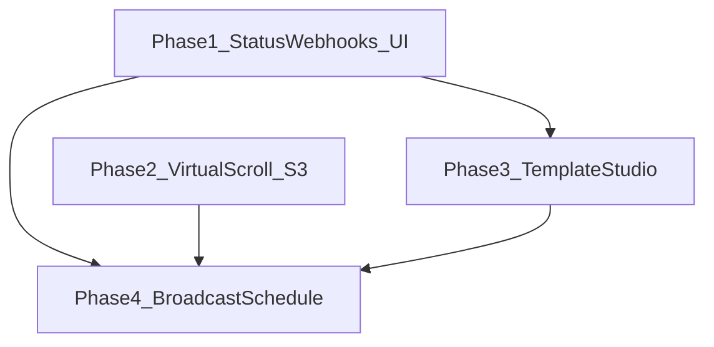

# WhatsApp Business Platform & Inbox — Product & Technical Plan

This document is the **canonical plan** for evolving unified inbox and WhatsApp capabilities **on Meta’s WhatsApp Business Platform (Cloud API)**. It does **not** include integration with third-party BSP products (e.g. DoubleTick as a vendor). The goal is **DoubleTick-class UX** (inbox, templates, broadcasts, scheduling) **implemented in our stack**.

**Related code (inventory):**

| Area | Location |
|------|-----------|
| Send (text, template, media) | [`backend/src/services/whatsappService.js`](../backend/src/services/whatsappService.js) |
| Meta webhook (verify + inbound) | [`backend/src/routes/whatsappWebhook.js`](../backend/src/routes/whatsappWebhook.js) |
| Inbound → lead + `Communication` | [`backend/src/services/whatsappInbound.js`](../backend/src/services/whatsappInbound.js) |
| Inbox API (send, attachments) | [`backend/src/routes/inbox.js`](../backend/src/routes/inbox.js) |
| Lead detail WhatsApp send | [`backend/src/routes/communications.js`](../backend/src/routes/communications.js) |
| Inbox UI | [`frontend/src/app/(dashboard)/inbox/page.tsx`](../frontend/src/app/(dashboard)/inbox/page.tsx) |
| **Settings → WhatsApp (API)** | [`backend/src/routes/settings.js`](../backend/src/routes/settings.js) (`GET/PUT /settings/whatsapp`, `POST /settings/whatsapp/test`) |
| **Settings → WhatsApp (UI)** | [`frontend/src/app/(dashboard)/settings/page.tsx`](../frontend/src/app/(dashboard)/settings/page.tsx) — `WhatsAppSection` |
| Env / defaults | [`backend/src/config/env.js`](../backend/src/config/env.js), [`backend/.env.example`](../backend/.env.example) |

---

## 1. Principles

1. **Single provider (Meta):** All sends and webhooks remain Cloud API–compatible. Org credentials stay in `organization.settings` (`whatsappNumbers[]`, tokens, verify token) plus env fallbacks.
2. **Compliance first:** Templates for outbound outside the 24-hour session window; respect `doNotCall` / marketing opt-out on leads; log failures per recipient for broadcasts.
3. **Incremental delivery:** Ship in phases with measurable outcomes; avoid big-bang releases.
4. **DB vs object storage:** Postgres remains source of truth for **metadata and pointers**; **binary media** may move to object storage when volume or cost requires it (see §7).

---

## 2. Current State (What Already Works)

- **Inbound messages:** Meta `whatsapp_business_account` webhook → parsing of text, buttons, interactive replies, media metadata → `processInboundWhatsAppMessage` → `Communication` + realtime.
- **Outbound from inbox:** WhatsApp channel uses `sendWhatsAppText` / `sendWhatsAppMedia` / `uploadWhatsAppMedia` from inbox routes.
- **Outbound from communications:** `POST /communications/send-whatsapp` and `send-whatsapp-template`; stores `waMessageId` in `metadata` when Meta returns it.
- **Attachments today:** Primarily **base64 in `Attachment.data`** in Postgres (commented for serverless persistence); optional legacy files under `uploads/inbox`.
- **Message status (gap):** Webhook receives `value.statuses` but today they are **logged only** — not persisted or shown in the UI.

---

## 3. Settings — WhatsApp menu (audit & planned additions)

### 3.1 What is implemented today

**Who can access:** Admin-only tab `WhatsApp` in Settings ([`settings/page.tsx`](../frontend/src/app/(dashboard)/settings/page.tsx)). **Super admins** must pick a **division** first (same pattern as email); **division admins** edit their own org.

**Stored in `organization.settings` JSON** (via [`mergeWhatsAppSettingsFromBody`](../backend/src/routes/settings.js)):

| Field | Purpose |
|--------|---------|
| `whatsappNumbers[]` | Per line: optional `label`, `phoneNumberId` (WABA **Phone number ID**), optional `displayPhone` (for webhook routing when Meta’s `phone_number_id` / display metadata must match), `token` (masked on read) |
| `whatsappWebhookVerifyToken` | Meta webhook **Verify token** (GET `hub.verify_token` handshake) |
| `whatsappApiUrl` | Optional override (default `https://graph.facebook.com/v22.0`) |

**UI blocks:** Webhook verify token + optional API URL; repeatable cards for each number (label, phone number ID, display phone, access token); “How to get these” copy for Meta Developer Console; save merges tokens so masked `••••••••` does not wipe secrets.

**Backend test endpoint:** `POST /settings/whatsapp/test` calls Graph with saved token + phone number ID and returns `display_phone_number` / `verified_name`. **Frontend:** [`api.testWhatsAppSettings`](../frontend/src/lib/api.ts) exists but **`WhatsAppSection` does not expose a “Test connection” button** — quick improvement.

---

### 3.2 Recommended additions (by product phase)

| Addition | Phase | Rationale |
|----------|--------|-----------|
| **“Test connection”** button per number (or one for selected row) calling `POST /settings/whatsapp/test` | **1** (UX) | Validates token + ID before going live; API already exists. |
| **Read-only webhook URL** with copy button (`{PUBLIC_API_URL}/api/whatsapp/webhook`) | **1** (UX) | Reduces misconfiguration in Meta Console; document that **POST** must subscribe to `messages` + **message status** for Phase 1 ticks. |
| **`whatsappBusinessAccountId` (WABA ID)** optional per division | **3** | Template list/create Graph calls are scoped to **WABA**, not only phone number ID; today operators must find WABA ID elsewhere. |
| **Template sync / “Refresh templates”** (admin) | **3** | Could live on Settings → WhatsApp *or* a dedicated Templates page; still needs WABA ID + token with `whatsapp_business_management` (or equivalent) permissions. |
| **Broadcast defaults** in settings (e.g. default template language, max messages/minute, org timezone for scheduling) | **4** | Keeps scheduler behavior explicit and auditable. |
| **Object storage** | **2** | Prefer **environment** for `AWS_ACCESS_KEY_ID`, `AWS_SECRET_ACCESS_KEY`, `S3_BUCKET`, `S3_REGION`; optional org-level **prefix** or “enable S3 for attachments” flag if multi-tenant isolation is required. |
| **Webhook POST signature verification** (`X-Hub-Signature-256` + **App Secret**) | **1–2** (security) | Not in settings today; typically **env** `META_APP_SECRET` or per-env secret — document in deployment guide. Optional future: store app secret per org (higher risk). |

---

### 3.3 Not needed in Settings (keep elsewhere)

- **Per-recipient opt-out:** Already on **Lead** (`doNotCall`, etc.); broadcasts must read that, not duplicate in WhatsApp settings.
- **Full template body CRUD UI:** Product surface can be **Templates** (Phase 3); settings only needs **credentials + WABA id** unless you want a single “WhatsApp hub” tab with sub-sections.

---

## 4. Phased Roadmap

### Phase 1 — Inbox reliability & “BSP feel” (foundation)

**Objective:** Users see accurate delivery/read state and a stable thread experience.

| # | Deliverable | Backend | Frontend |
|---|-------------|---------|----------|
| 1.1 | Persist Meta **message status** (sent / delivered / read) | On `statuses` in webhook: resolve outbound `Communication` by `metadata.waMessageId` (and disambiguate with `phone_number_id` if needed); merge timestamps into `metadata` or new nullable columns | Inbox thread: show ticks or labels; invalidate TanStack queries or reuse websocket on update |
| 1.2 | **Meta app configuration** | Document: webhook fields must include **messages** and **message status** (or equivalent) | Settings: show callback URL + subscription checklist |
| 1.3 | Correlation hardening | Ensure every outbound WhatsApp path records `waMessageId` where Meta provides it (text, media, template) | — |
| 1.4 | **Settings UX** | — | Wire **`testWhatsAppSettings`**; optional App Secret in env + signature verification on `POST /whatsapp/webhook` |

**Success criteria:** After sending from inbox, delivered/read updates from Meta appear in the product within seconds; no regression on inbound.

---

### Phase 2 — Inbox scale & media architecture (optional but recommended before heavy media)

**Objective:** Smooth UI with large lists and sustainable storage.

| # | Deliverable | Notes |
|---|-------------|--------|
| 2.1 | **Virtualized conversation list** | Add `react-virtuoso` or `@tanstack/react-virtual` for the left pane (`sortedConversations.map`). Measure before virtualizing the message column (grouped bubbles + variable height). |
| 2.2 | **Object storage for attachments** (S3-compatible) | Upload to bucket after multer; store `url` or `key` + `mimeType` + `size` in `Attachment`; serve via signed URL or authenticated proxy. Migrate existing base64 rows in a background job. **Does not replace** Meta’s media IDs for WhatsApp Cloud API upload/download. Document env vars; optional org flag/prefix in Settings if multi-tenant isolation is required. |
| 2.3 | **Pagination / “load older messages”** | Align UI with API `page`/`limit` if threads grow beyond current caps. |

**Success criteria:** 500+ conversation rows without scroll jank; DB growth from attachments under control.

---

### Phase 3 — Template studio (CRUD via Meta)

**Objective:** Manage templates from the app while **Meta remains the system of record**.

| # | Deliverable | Notes |
|---|-------------|--------|
| 3.1 | **List & sync** | Call Graph API message templates for the WABA tied to org credentials; cache in DB (`WhatsAppTemplateCache` or generic JSON table) with `lastSyncedAt`. **Settings:** add optional **WABA ID** (+ token permissions); “Sync templates” action on WhatsApp tab or Templates page. |
| 3.2 | **Create / edit** | Use Meta’s template creation/update endpoints; map UI fields to components (header/body/footer/buttons); surface rejection reasons from Meta. Requires correct **permissions** and often **Business verification**. |
| 3.3 | **Delete / deprecate** | Follow Meta’s supported lifecycle; reflect status in UI (APPROVED, PENDING, REJECTED, etc.). |
| 3.4 | **Webhook** | Subscribe to template-related events if available; refresh cache on change. |

**Success criteria:** Users can pick approved templates in inbox/broadcast flows without opening Business Manager for routine work.

---

### Phase 4 — Broadcast lists & scheduled sends

**Objective:** Marketing/utility broadcasts with auditability — **not** the same as existing CRM “Campaign” entities used for offer assignments.

| # | Deliverable | Notes |
|---|-------------|--------|
| 4.1 | **Broadcast list (audience)** | New models: e.g. `WhatsAppBroadcastList` (org, name, filters or static member set), `WhatsAppBroadcastListMember` (leadId or phone + consent flags). Respect `doNotCall` and template-only rules outside 24h window. |
| 4.2 | **Broadcast run** | `WhatsAppBroadcast` + `WhatsAppBroadcastRecipient`: template name, language, component parameters, status, error, `waMessageId`, timestamps. Throttle sends to Cloud API **tier limits**; retries with backoff. |
| 4.3 | **Schedule** | `scheduledAt`, job runner (extend existing scheduler pattern in [`backend/src/index.js`](../backend/src/index.js) or queue); transition states: `draft` → `scheduled` → `running` → `completed` / `failed`. |
| 4.4 | **UI** | Lists CRUD, recipient preview, “send now” vs schedule, run history and per-recipient errors. |
| 4.5 | **Broadcast defaults in settings** | Optional `organization.settings.whatsappBroadcast` (default language, throttle, timezone hints) — same WhatsApp tab subsection or link from Broadcast UI. |

**Success criteria:** Scheduled broadcast executes without manual intervention; full trace for compliance and debugging.

---

## 5. Dependency Order (Mermaid)

Templates and broadcasts both depend on **reliable template names/languages** and **outbound correlation** (Phase 1). Heavy broadcasts benefit from **Phase 2** storage and UI scale.

---

## 6. Risks & Mitigations

| Risk | Mitigation |
|------|------------|
| Meta rejects templates | Show API errors; keep BM fallback documented |
| Throughput limits on broadcast | Batching, queue, visible “estimated completion” |
| Wrong org on multi-WABA | Match `phone_number_id` on status webhooks and sends |
| PII in logs | Redact phone bodies in production logs; secure attachment URLs |

---

## 7. Out of Scope (for this plan)

- Replacing Meta with another BSP.
- SMS/email feature parity (inbox already multi-channel; this plan focuses on WhatsApp depth).
- Building a full marketing automation suite beyond lists + schedule + template sends.

---

## 8. Decision Log (to fill during implementation)

| Decision | Options | Choice | Date |
|----------|---------|--------|------|
| Status storage | `metadata` only vs Prisma columns | TBD | |
| Virtual list library | Virtuoso vs TanStack Virtual | TBD | |
| Object storage | AWS S3 vs Cloudflare R2 vs GCS | TBD | |
| Job runner | Cron polling vs Redis queue | TBD | |

---

*Maintainers: update this file when phases complete or scope changes.*
